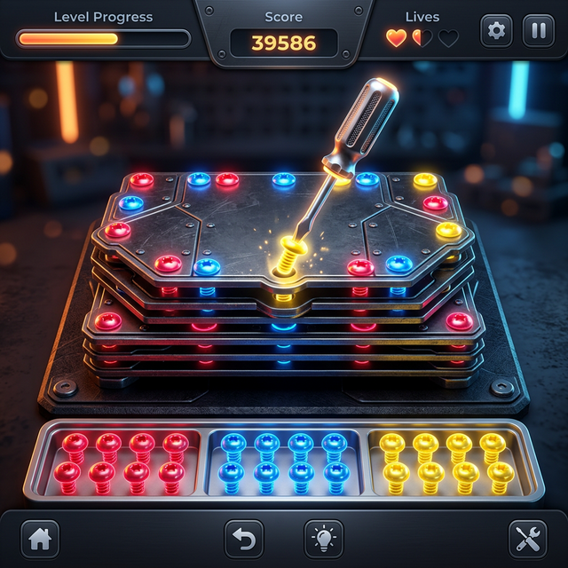
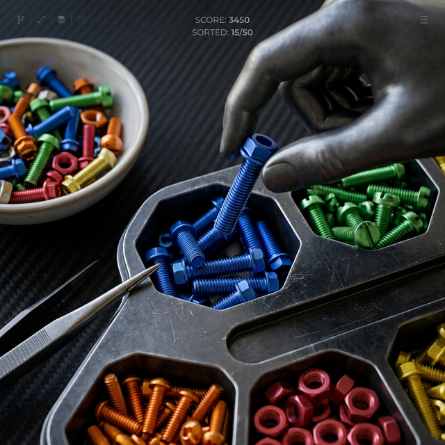

# ⚙️ Screw & Sort: Metal ASMR


Tatmin edici ve rahatlatıcı bir Metal ASMR bulmaca oyunu. Metal plakalardaki renkli vidaları sökün ve tahtayı temizlemek için alttaki yuvalarda aynı renkten üç vidayı eşleştirin.

**Bu sürüm tamamen reklamsızdır!** Kesintisiz bir deneyim için tüm reklam entegrasyonları kaldırılmıştır.

---

## 📸 Oyun Görselleri


*Gelişmiş grafikler ve tatmin edici düzenleme mekanikleri.*


*Yüksek kaliteli metalik dokular ve canlı renkler.*

---

## 🎮 Nasıl Oynanır?
1. **Vida Sökme:** Herhangi bir renkli vidaya tıklayarak onu yerinden sökün.
2. **Eşleştirme:** Sökülen vida otomatik olarak alttaki boş yuvalara taşınır.
3. **Temizleme:** Aynı renkteki 3 vidayı yan yana getirdiğinizde eşleşerek yok olurlar ve puan kazandırırlar.
4. **Hedef:** Süre bitmeden veya canınız tükenmeden tüm plakaları düşürerek seviyeyi tamamlayın.

## ✨ Özellikler
- **Saf JavaScript:** Ağır framework'ler yok, tamamen HTML5 Canvas ile geliştirildi.
- **Premium Estetik:** Neon detaylar, metalik tasarımlar ve pürüzsüz animasyonlar.
- **ASMR Efektleri:** Tatmin edici ses efektleri ve görsel parçacık sistemi.
- **Reklamsız:** Kesinti yok, "Reklam İzle" pop-up'ları yok.
- **Duyarlı (Responsive):** Hem masaüstü hem de mobil cihazlarda sorunsuz çalışır.

## 🛠️ Proje Yapısı
```text
├── index.html      # Ana oyun giriş noktası
├── game.js        # Çekirdek oyun mantığı ve fizik
├── style.css      # Modern UI ve animasyonlar
├── start_bg.png   # Klasik arka plan görseli
└── README.md      # Bu rehber
```

## 🚀 Kurulum ve Yayınlama

### Yerelde Çalıştırma
1. **Depoyu klonlayın:**
   ```bash
   git clone https://github.com/Tparlak/screw-and-sort-metal-asmr.git
   ```
2. **`index.html`** dosyasını tarayıcınızda açın.

### GitHub Pages'te Yayınlama
Bu oyunu internet üzerinden oynamak için şu adımları izleyin:
1. GitHub reponuzda **Settings > Pages** sekmesine gidin.
2. **Branch** kısmından `main` branch'ini seçin ve **Save** deyin.
3. Birkaç dakika içinde oyununuz şu adreste yayında olacaktır:
   **[https://tparlak.github.io/screw-and-sort-metal-asmr/](https://tparlak.github.io/screw-and-sort-metal-asmr/)**

---
*ASMR oyun topluluğu için ❤️ ile oluşturuldu.*
