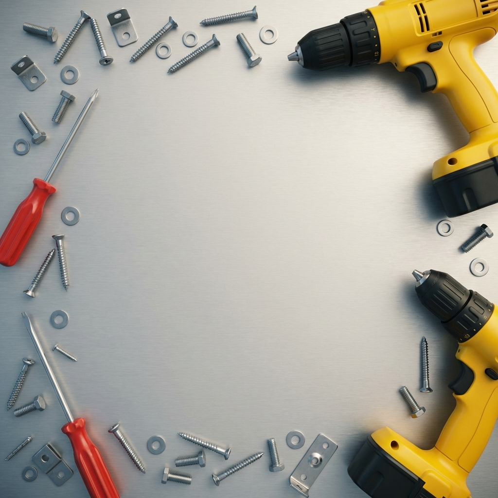

# ⚙️ Screw & Sort: Metal ASMR



Tatmin edici ve rahatlatıcı bir Metal ASMR bulmaca oyunu. Metal plakalardaki renkli vidaları sökün ve tahtayı temizlemek için alttaki yuvalarda aynı renkten üç vidayı eşleştirin.

**Bu sürüm tamamen reklamsızdır!** Kesintisiz bir deneyim için tüm GameDistribution SDK entegrasyonları kaldırılmıştır.

## 🎮 Nasıl Oynanır?
- **Vida Sökme:** Herhangi bir renkli vidaya tıklayarak onu yerinden sökün.
- **Eşleştirme:** Sökülen vida otomatik olarak alttaki boş yuvalara taşınır.
- **Temizleme:** Aynı renkteki 3 vidayı yan yana getirdiğinizde eşleşerek yok olurlar ve puan kazandırırlar.
- **Hedef:** Süre bitmeden veya canınız tükenmeden tüm plakaları düşürerek seviyeyi tamamlayın.

## ✨ Özellikler
- **Saf JavaScript:** Ağır framework'ler yok, tamamen HTML5 Canvas ile geliştirildi.
- **Premium Estetik:** Neon detaylar, metalik tasarımlar ve pürüzsüz animasyonlar.
- **ASMR Efektleri:** Tatmin edici ses efektleri ve görsel parçacık sistemi.
- **Reklamsız:** Kesinti yok, "Reklam İzle" pop-up'ları yok.
- **Duyarlı (Responsive):** Hem masaüstü hem de mobil cihazlarda sorunsuz çalışır.

## 🛠️ Proje Yapısı
```text
├── index.html      # Ana oyun giriş noktası
├── game.js        # Çekirdek oyun mantığı ve fizik
├── style.css      # Modern UI ve animasyonlar
├── start_bg.png   # Premium arka plan görseli
└── README.md      # Bu rehber
```

## 🚀 Kurulum ve Çalıştırma
1. **Depoyu klonlayın:**
   ```bash
   git clone https://github.com/Tparlak/screw-and-sort-metal-asmr.git
   ```
2. **`index.html`** dosyasını herhangi bir modern web tarayıcısında açın.
3. **Oynayın!** Kurulum veya sunucu gerektirmez.

## 🌐 Canlı Demo
Oyunun canlı sürümünü buradan oynayabilirsiniz (GitHub Pages etkinse):
[https://tparlak.github.io/screw-and-sort-metal-asmr/](https://tparlak.github.io/screw-and-sort-metal-asmr/)

---
*ASMR oyun topluluğu için ❤️ ile oluşturuldu.*
